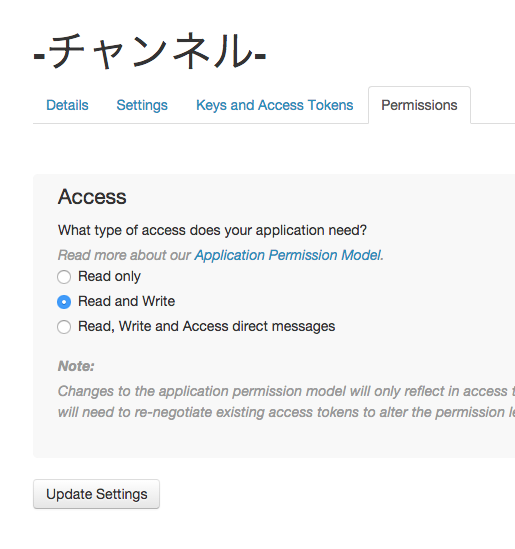
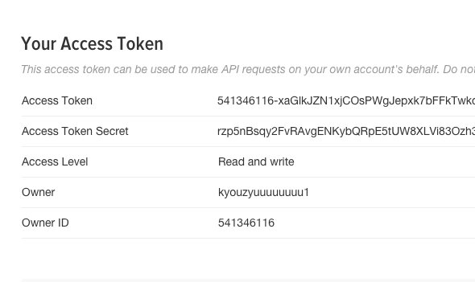
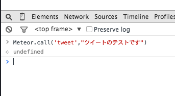
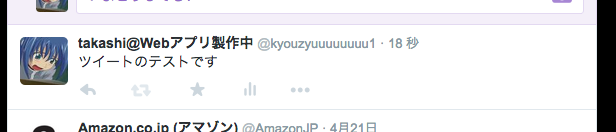

# 10分でMeteorからTwitterにツイートしてみる。
完成レポジトリは[こちら](https://github.com/endows/tweet_with_meteor)

さて、いきましょう。

まずはTwitterAppの権限を上げます。

次にMeteorアプリを作成

```bash
meteor create tweet_with_meteor
cd tweet_with_meteor
meteor
```
MeteorにはTwitterAPIを叩くライブラリもありますが、調子が悪かったので、今回はnpmにあるライブラリをMeteorから叩いて使用します。

まず,npmをMeteorから使うためのライブラリをインストールします。
```
meteor add meteorhacks:npm
```
次に読み込むnpmライブラリを指定します。ここで注意していただきたいのは、packages.jsonということです。npmで使うpackage.jsonとは別物であります。今回はその名の通り、Twitterというライブラリを使います。
```packages.json
{
  "twitter":"1.2.5"
}
```
これでMeteorを再起動すれば自動でインストールされます。ではさっそく使ってみましょう。

```javascript:tweet_with_meteor.js
if (Meteor.isServer) {
  Meteor.startup(function() {
    var Twitter = Meteor.npmRequire('twitter');
    var client = new Twitter({
      consumer_key: '',
      consumer_secret: '',
      access_token_key: '',
      access_token_secret: ''
    });

    Meteor.methods({
      'tweet':function(text){
        client.post('statuses/update', {
          status: text
        }, function(error, tweet, response) {
          console.log(error)
          if (error) throw error;
        });
      }
    })

  });
}

```
KEYはこの辺から拝借してください。


それでは使ってみましょう。



すると

こんな感じにツイートされていますね。成功です。

## 作者紹介
遠藤孝志(えんどうたかし)。福島県出身の２２歳。
オンライン観戦アプリ、パブリックビューイング([public-viewing.tk](public-viewing.tk))の運営者。使用言語はNode.js,Rails,Angular,Meteor。現在、協力者募集中

Twitter : [@kyouzyuuuuuuuu1](https://twitter.com/kyouzyuuuuuuuu1)  
github : https://github.com/endows/  
mail : endotakashi1992@gmail.com  
